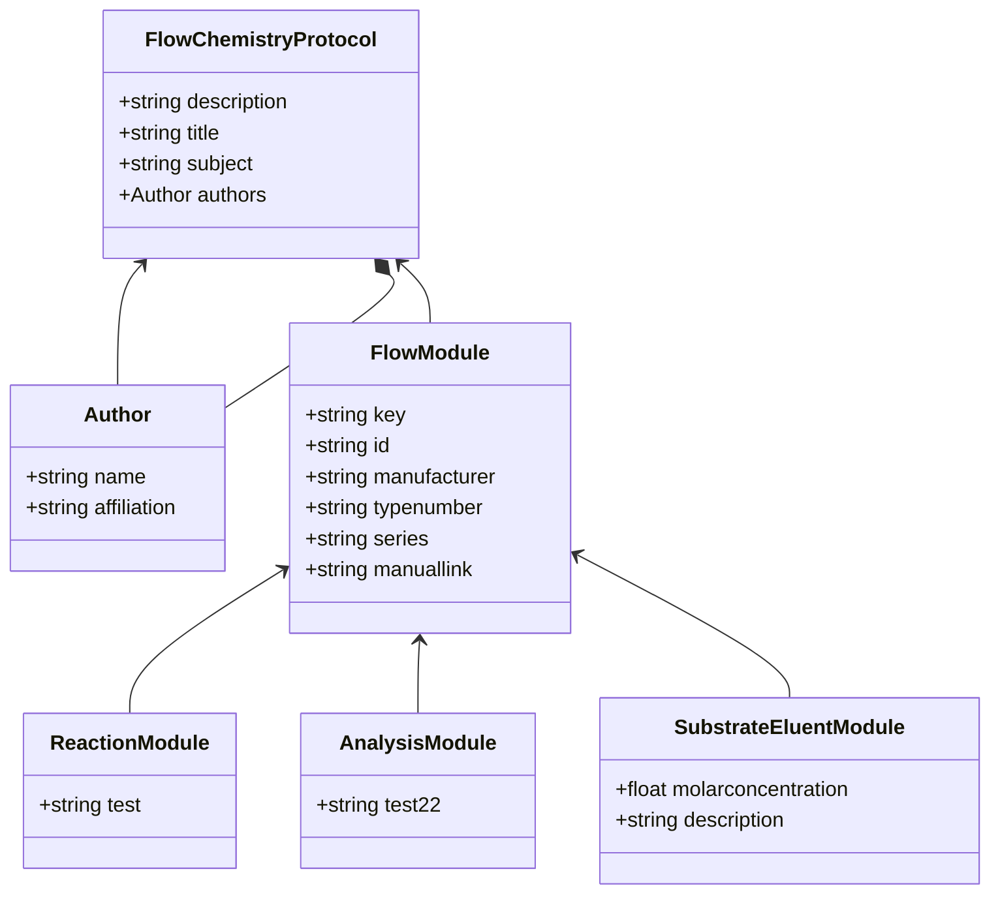

```mermaid
classDiagram
    FlowChemistryProtocol <-- Author
    FlowChemistryProtocol <-- FlowModule
    FlowModule <-- ReactionModule
    FlowModule <-- AnalysisModule
    FlowModule <-- SubstrateEluentModule
    FlowChemistryProtocol *-- Author
    
    class FlowChemistryProtocol {
        +string description
        +string title
        +string subject
        +Author authors
    }
    
    class Author {
        +string name
        +string affiliation
    }
    
    class FlowModule {
        +string key
        +string id
        +string manufacturer
        +string typenumber
        +string series
        +string manuallink
    }
    
    class ReactionModule {
        +string test
    }
    
    class AnalysisModule {
        +string test22
    }
    
    class SubstrateEluentModule {
        +float molarconcentration
        +string description
    }
    
```