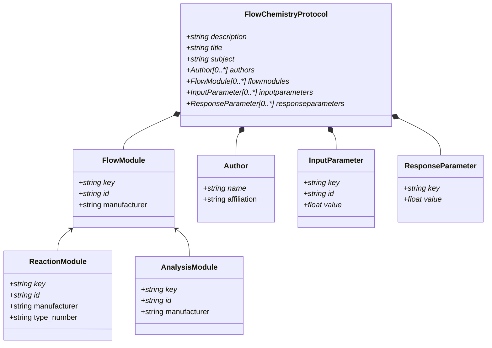

```mermaid
classDiagram
    FlowModule <-- ReactionModule
    FlowModule <-- AnalysisModule
    FlowChemistryProtocol *-- Author
    FlowChemistryProtocol *-- FlowModule
    FlowChemistryProtocol *-- InputParameter
    FlowChemistryProtocol *-- ResponseParameter
    
    class FlowChemistryProtocol {
        +string description*
        +string title*
        +string subject*
        +Author[0..*] authors*
        +FlowModule[0..*] flowmodules*
        +InputParameter[0..*] inputparameters*
        +ResponseParameter[0..*] responseparameters*
    }
    
    class Author {
        +string name*
        +string affiliation
    }
    
    class FlowModule {
        +string key*
        +string id*
        +string manufacturer
    }
    
    class ReactionModule {
        +string key*
        +string id*
        +string manufacturer
        +string type_number
    }
    
    class AnalysisModule {
        +string key*
        +string id*
        +string manufacturer
    }
    
    class InputParameter {
        +string key*
        +string id*
        +float value*
    }
    
    class ResponseParameter {
        +string key*
        +float value*
    }
    
```