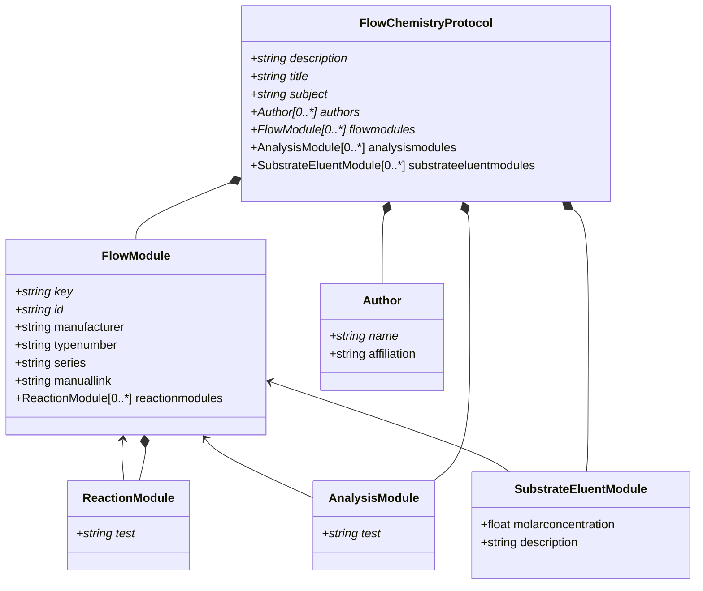

```mermaid
classDiagram
    FlowModule <-- ReactionModule
    FlowModule <-- AnalysisModule
    FlowModule <-- SubstrateEluentModule
    FlowChemistryProtocol *-- Author
    FlowChemistryProtocol *-- FlowModule
    FlowChemistryProtocol *-- AnalysisModule
    FlowChemistryProtocol *-- SubstrateEluentModule
    FlowModule *-- ReactionModule
    
    class FlowChemistryProtocol {
        +string description*
        +string title*
        +string subject*
        +Author[0..*] authors*
        +FlowModule[0..*] flowmodules*
        +AnalysisModule[0..*] analysismodules
        +SubstrateEluentModule[0..*] substrateeluentmodules
    }
    
    class Author {
        +string name*
        +string affiliation
    }
    
    class FlowModule {
        +string key*
        +string id*
        +string manufacturer
        +string typenumber
        +string series
        +string manuallink
        +ReactionModule[0..*] reactionmodules
    }
    
    class ReactionModule {
        +string test*
    }
    
    class AnalysisModule {
        +string test*
    }
    
    class SubstrateEluentModule {
        +float molarconcentration
        +string description
    }
    
```